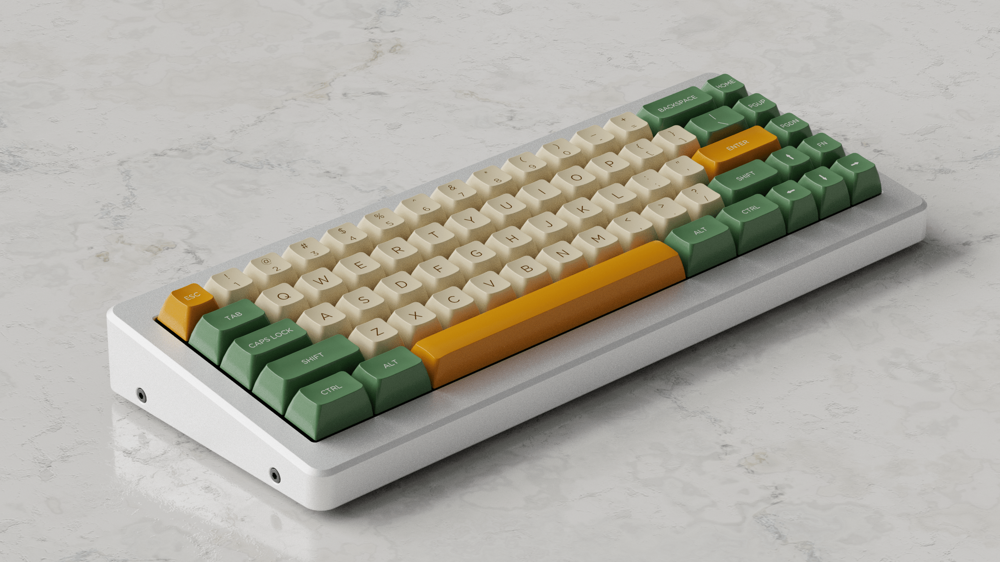
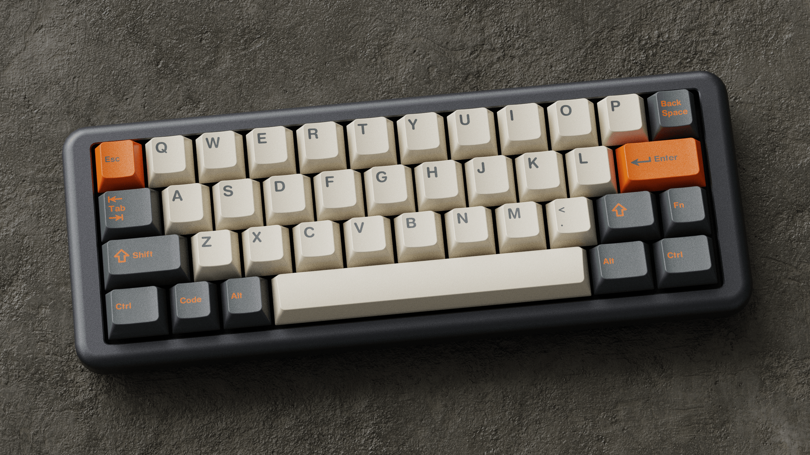

# kbrenders

kbrenders is a cloud service that provides professional quality 3D renders of custom keycap designs. The app uses a flask "frontend" server to manage orders and place them into an AWS SQS queue. Then, every night, an auto-scaling group of EC2 spot instances renders each queued job using blender, and emails the final image to the customer with mailgun. kbrenders can provide accurate visualizations to more people, more quickly and cheaply than the visualization services of individual artists. Unlike KLE-Render, kbrenders only supports a limited number of keyboard layouts, but its renders are actually ray-traced and thus much more realistic. 

This repo is only for the "frontend" server component of kbrenders. The backend code is in the kbrenders-backend repository.

## Sample Renders

SA Lunchbar on M65-A, Side View

GMK Carbon on Mech Mini 2, Top View
