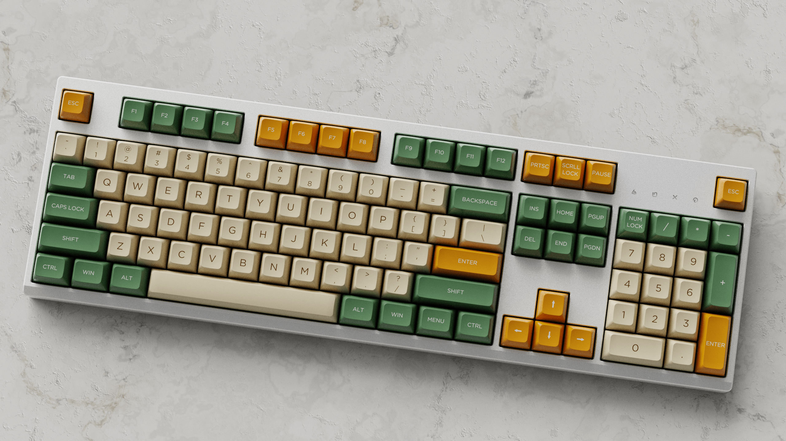

# KBRenders
> Fast & Affordable 3D Keycap Renders

KBRenders is an online service for fast, professional quality 3D renders of custom keycap designs. The app uses a flask webapp to manage orders and place them into a redis queue. Worker servers then render each queued job using blender, and email the final image to the customer with mailgun within 2 hours. Check it out at [kbrenders.com](https:/kbrenders.com/).

## Sample Image
SA Lunchbar on Triangle, Top View ([JSON](http://www.keyboard-layout-editor.com/#/gists/b86a688e6502fcc910d4b32ca2fa642e))

